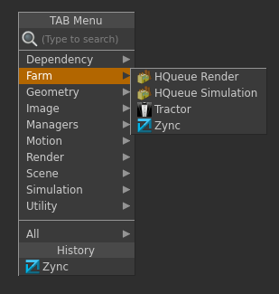

# zync-houdini

# Warning

Note that the simplest and recommended way to install Zync plugins is through the  Zync Client Application (see [instructions](https://sites.google.com/site/zyncpublic/doc/install#plugins)). The steps described below are for advanced users and we recommend to proceed with them only if you need to modify the plugin code for your custom needs.

## Installation

To install plugin one has to take the following steps:

1. Clone this repository into your machine.

2. Find your `houdini.env` file. [How to find houdini.env.](http://www.sidefx.com/docs/houdini/basics/config_env)
   Add the following section to this file.

    ```
    HOUDINI_PATH = "$HOUDINI_PATH;/path/to/zync-houdini/;&"
    ```

    Be careful about preserving `;&` at the end. If you are using Windows make
    sure you are using forward slashes `/` instead of backslashes. Ex.
    `Z:/plugins/zync-houdini` Remember to replace path with the proper path to
    zync-houdini directory.

3. Clone `zync-python` repository. Then, take one of these steps:
    * Add `ZYNC_API_DIR` environment variable containing path to zync-python.
    * Create `config_houdini.py` and put path to `zync-python` in `API_DIR` variable.

4. Restart Houdini.

## Verification of the installation

In order to check if the plugin was installed properly launch Houdini and go to
`/out` network. Verify that `Zync` tool appears under `Farm` section of the `Tool Menu`.


